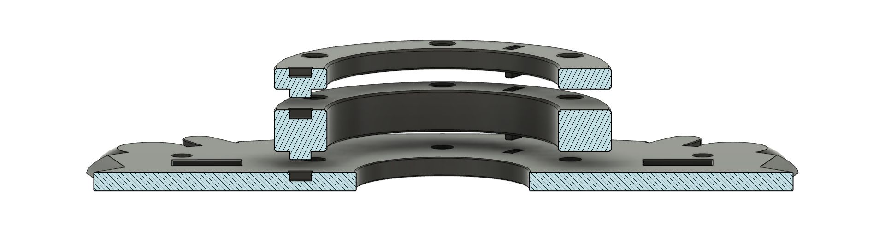

## About the Mod:
Complete transformation kit with metal adapter for your Fanatec GT DD Pro Wheel. 
Allows you to use the original Hub with any 6x70 mm aftermarket wheel (with a horn button hole) while preserving all buttons and displays.

### About paddle shifters:
The kit does not include paddle shifters but is designed for easy installation of aftermarket paddle shifters with a 6x70 mm mounting plate. Example of compatible paddle shifters:
https://fr.aliexpress.com/item/1005008666478656.html

### On mounting a dished wheel:
Because the wheel sits behind the hub, it may interfere with the hub. The optional add-on kit includes two sets of longer screws as well as three additional spacers to adjust the distance between the hub and the steering wheel.

   
  <strong>Stackable spacers on hub</strong>

### Installation tutorial: 
https://youtu.be/lOmiRt0ZHKk?si=0wj7zZqrhEkcl3WW
